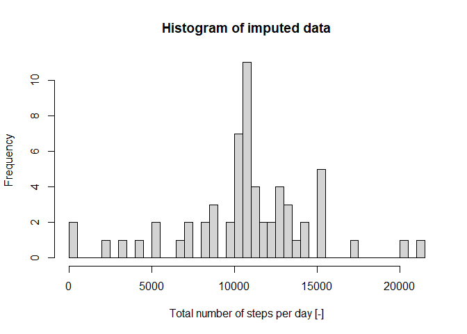

## Loading and preprocessing the data

Unzip and read, recognize date as such:


```r
df <- read.table(unz("activity.zip", "activity.csv"), header=T, sep=",")
df$date <- as.Date(df$date)
```

## What is mean total number of steps taken per day?

Plot the histogram:


```r
library(dplyr)
```

```
## 
## Attaching package: 'dplyr'
```

```
## The following objects are masked from 'package:stats':
## 
##     filter, lag
```

```
## The following objects are masked from 'package:base':
## 
##     intersect, setdiff, setequal, union
```

```r
df %>% na.omit() %>% group_by(date) %>% summarize(sum = sum(steps)) -> summed
```

```
## `summarise()` ungrouping output (override with `.groups` argument)
```

```r
hist(summed$sum, breaks=53, xlab="Number of steps per day [-]", main="Histogram of total number of steps per day")
```

<!-- -->

Calculate the mean and median:


```r
mean(summed$sum, na.rm = TRUE)
```

```
## [1] 10766.19
```

```r
median(summed$sum, na.rm = TRUE)
```

```
## [1] 10765
```

## What is the average daily activity pattern?

Calculate the average and make a time series plot:


```r
df %>% na.omit() %>% group_by(interval) %>% summarize(mean = mean(steps)) -> average
```

```
## `summarise()` ungrouping output (override with `.groups` argument)
```

```r
plot(average$interval, average$mean, type="l", xlab="Interval", ylab="Mean")
```

<!-- -->

Interval with maximum number of steps:


```r
maxind <- which.max(average$mean)
average$interval[maxind]
```

```
## [1] 835
```
Thus, in the interval starting at minute 835 the most steps are taken on average.

## Imputing missing values

Determine the number of NA values:


```r
sum(is.na(df$steps))
```

```
## [1] 2304
```

Impute missing values by mean value of that 5-min interval across all days:


```r
na <- is.na(df$steps)
dfimp <- df
for(i in  1:nrow(dfimp)) 
    if(na[i]) 
        dfimp$steps[i] <- average$mean[which(dfimp$interval[i] == average$interval)]
```

Make a histogram of the total number of steps taken each day and calculate the mean and median total number of steps taken per day.


```r
dfimp %>% group_by(date) %>% summarize(sum = sum(steps)) -> summedimp
```

```
## `summarise()` ungrouping output (override with `.groups` argument)
```

```r
hist(summedimp$sum, breaks=61, xlab="Total number of steps per day [-]", main="Histogram of imputed data")
```

<!-- -->

Calculate the mean and median:


```r
mean(summedimp$sum, na.rm = TRUE)
```

```
## [1] 10766.19
```

```r
median(summedimp$sum, na.rm = TRUE)
```

```
## [1] 10766.19
```
Thus, with imputed data the median is the same as the mean in this case.

## Are there differences in activity patterns between weekdays and weekends?

Create the factor variable type:


```r
dfimp$type <- factor(weekdays(dfimp$date) %in% c("Samstag", "Sonntag"), labels = c("weekday", "weekend"))
```

Calculate average for the intervals:

```r
dfimp %>% na.omit() %>% group_by(interval, type) %>% summarize(mean = mean(steps)) -> averageimp
```

```
## `summarise()` regrouping output by 'interval' (override with `.groups` argument)
```

Create a panel plot:


```r
library(ggplot2)
ggplot(averageimp, aes(interval, mean)) + geom_line() + facet_grid(type ~ .) + ylab("Number steps") + xlab("Interval")
```

<!-- -->
